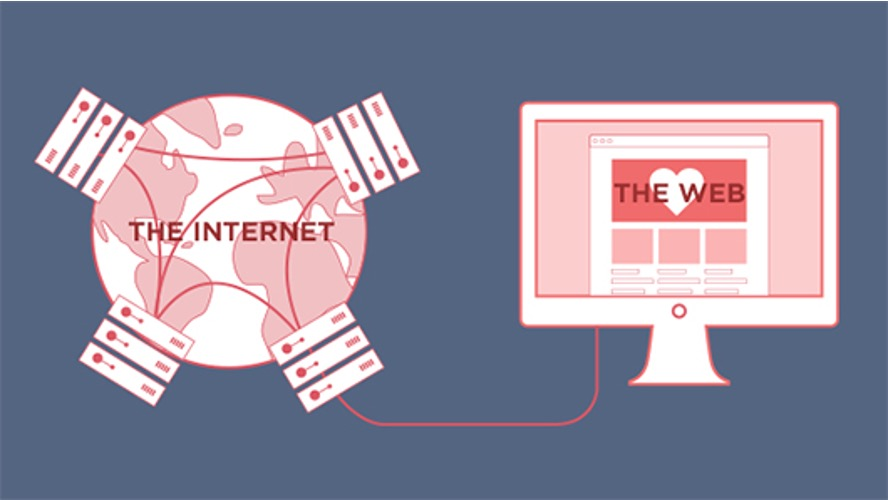

## 1. Difference Between the Internet and the WWW

### The Internet === The WWW ??



### The Internet:
- **Definition**: The Internet is a global network of interconnected computers and other devices. It is the infrastructure that enables various types of digital communication and data exchange.
- **History**: The development of the Internet began in the late 1960s with the creation of ARPANET, a project funded by the U.S. Department of Defense. Over the following decades, it evolved into a global network with the adoption of TCP/IP protocols in the 1980s.
- **Components**: The Internet consists of hardware (servers, routers, cables) and software protocols (TCP/IP, HTTP).
pages.
- **Functions**: It supports a wide range of services such as email, file transfer, instant messaging, and, of course, the World Wide Web.
- **Analogy**: Think of the Internet as the physical network of roads and highways.

### The World Wide Web (WWW):
- **Definition**: The World Wide Web is a collection of information, accessible via the Internet, which is formatted and interlinked using hypertext and hypermedia. It is a service that operates on the Internet.
**History**: The World Wide Web was invented by Tim Berners-Lee in 1989 while working at CERN. He developed the first web browser and web server, and the first website went live in 1991. The WWW rapidly grew in popularity throughout the 1990s, becoming a major part of everyday life.
- **Components**: The WWW consists of web pages, websites, and web browsers. Web pages are documents written in HTML and accessed through URLs.
- **Functions**: It allows users to access and navigate web pages through web browsers (like Chrome, Firefox, Safari). These pages can contain text, images, videos, and links to other 

- **Analogy**: Think of the WWW as a specific system of paths and landmarks (websites and web pages) that exist on the physical roads and highways (the Internet).


### Summary:
- **Internet**: The underlying global network connecting millions of computers.
- **WWW**: A subset of the Internet, consisting of web pages and sites, accessed through web browsers.

The WWW relies on the Internet to function, but the Internet also supports many other services beyond the Web.

```javascript

console.log("hello")

```

```kts
dependencies {
  implementation("org.jetbrains:markdown:<version>")
}
```

```kotlin
val src = "Some *Markdown*"
val flavour = CommonMarkFlavourDescriptor()
val parsedTree = MarkdownParser(flavour).buildMarkdownTreeFromString(src)
val html = HtmlGenerator(src, parsedTree, flavour).generateHtml()
```

